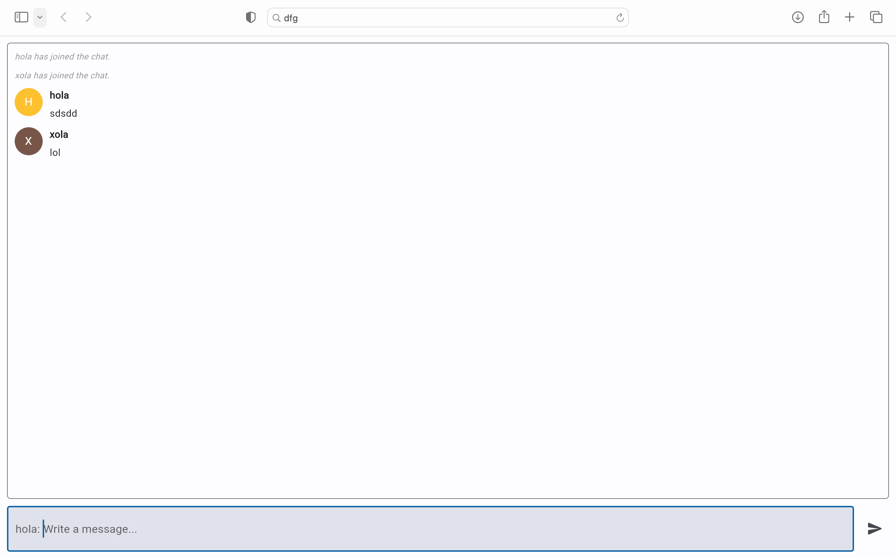

> Simple Realtime Chat App Using Flutter and Python (ft. [flet.dev](https://flet.dev/))

> Check Python v3+ & Pip v3+ is installed?
```bash
python --version
pip --version
```

> Installation 
 ```bash
 pip install -r requirements.txt
 ```

> Run code
```bash
python chat.py

# navigate to your browser: http://127.0.0.1:8550/
```


